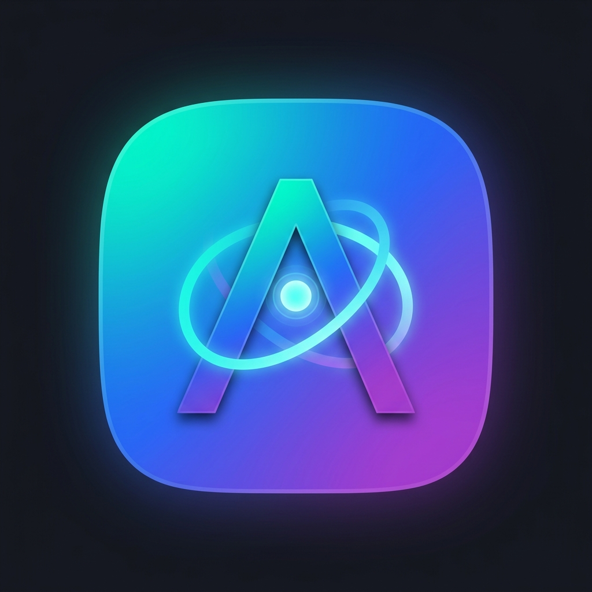

<div align="center">



# 🪐 Aeth OS

**随身携带的 AI 原生操作系统 | Portable AI-Native Debian Live USB Operating System**

[](LICENSE)
[](https://www.debian.org/)
[](https://www.gnome.org/)
[](https://m3.material.io/)
[](https://github.com/earendil-works/pi-coding-agent)
[]()

[简体中文](#-简体中文) | [English](#-english)

</div>

---

## 📖 简体中文

### 💡 什么是 Aeth OS？

**Aeth OS**（源自 *Aether*，以太）是一个专为开发者和 AI 协同打造的随身 U 盘 Linux 操作系统。它不是简单的发行版定制，而是一个将 **AI Coding Agent**、**无干扰后台环境**、**系统原生辅助功能总线 (AT-SPI2)** 和 **本地离线语音交互** 深度耦合为一体的现代化操作系统。

只需将制作好的 U 盘插入任意 x86_64 电脑，即可秒级启动进入预装完整开发环境的 AI 协同伴生空间；数据通过 Ext4 OverlayFS 实时持久化保存，拔出即走。

---

### ✨ 核心特性

#### 1. 👻 幽灵桌面 (Ghost Workspace) 与 Computer Use 网关
- **零干扰多任务**：人类在主工作区（Workspace 1）专注编码与网页浏览，AI Agent 的自动化任务运行在后台专属的幽灵工作区（Workspace 2）。
- **原生语义树感知**：集成 `computer-use-gateway`，基于原生 AT-SPI2 D-Bus 辅助功能总线毫秒级提取控件树与坐标（`--dump-tree`），不依赖脆弱的视觉 OCR，绝不抢占人类焦点与鼠标指针。

#### 2. 🪟 Zellij 65:35 终端伴生与全双工 Shell Hooks
- **双屏协同布局**：左侧 **65%** 为主 Shell 窗格（获焦），右侧 **35%** 为常驻伴生 Pi Agent 窗格（若无环境则自动平滑降级至 bash）。
- **Shell Hooks 智能感知**：命令退出码异常时，毫秒级异步向本地套接字投递诊断事件；内置 `Alt+A`（提交命令行）、`Alt+B`（捕获最后 50 行日志）、`Alt+C`（呼叫幽灵桌面协助）。

#### 3. 🌐 优化版 Browser Use 与会话持久化
- **紧凑无障碍树快照**：桥接 `agent-browser` 与 Chromium CDP 调试端口（9222），将网页提炼为精简的 `@eN` 无障碍快照，节约 80%+ 上下文 Token。
- **验证码无缝召回**：平时后台无头运行，遭遇复杂人机验证时调用 `aeth-browser-launcher --reveal` 立即切换至 Workspace 1 由人类处理。
- **持久化 Cookie**：专用浏览器 Profile 存储于持久化分区，重启后保持登录态。

#### 4. 🎨 Material Design 3 桌面与专注细节
- **现代美学**：Material Slate 深色基底搭配柔和以太渐变，Papirus-Material 矢量图标。
- **预置 Nerd Fonts**：开机即用 FiraCode Nerd Font（开启编程连字）与 JetBrainsMono Nerd Font，终端与状态栏图标零乱码。
- **视线聚焦与禅模式**：非活动窗口自适应微调压暗 15%；按 `Super+F11` 触发禅模式（Zen Mode），自动隐藏顶栏并静音通知。

#### 5. 🎙️ 本地离线语音输入法与 GNOME 原生 UI
- **纯本地转录**：集成 `whisper.cpp` 与中英离线优化模型（`ggml-base.bin`，~140MB），断网可用、零流量、隐私安全。
- **VAD 智能断句**：按 **`F5`** 开始说话，停顿 1.0 秒后 VAD 自动截断并上屏至当前光标，无需按第二次按键！
- **Agent 直达**：按 **`Super+F5`** 全局截获语音，转录后直接作为 Prompt 投递至右侧伴生 Pi Agent。

#### 6. 🧠 Pi Agent 专属 5 大 Skills 体系与自由模型配置
- **原生自由配置**：坚守 Unix 哲学，通过 `~/.config/pi/config.json` 模板原生配置，直接支持 Ollama 本地模型、DeepSeek、Claude、OpenAI，杜绝臃肿问答菜单。
- **5 大专属系统技能**：
  - `skill-computer-use`：GUI 辅助功能控件树检索与键鼠操控；
  - `skill-browser-use`：网页极速无障碍快照与导航；
  - `skill-agent-memory`：基于 SQLite 的跨电脑持久化外脑记忆；
  - `skill-os-admin`：调用系统体检、WiFi 管理与软件包安装；
  - `skill-terminal-sync`：Zellij 左侧视口抓取与推荐命令注入。

#### 7. ⚡ Direct-Stream 按需分页：物理内存释放 85%+
- 坚决摒弃将数 GB 镜像全塞入内存的 `toram` 模式，系统冷启动仅占用约 700MB 物理内存，**将 85% 以上的主机内存完整保留给本地大模型（如 Ollama）与重度开发**。
- 采用 zRAM 压缩内存交换（`zstd` 算法），彻底避免因物理交换空间写损耗损坏 U 盘。

---

### 🛠️ 系统专属工具命令速查

| 工具命令 | 兼容别名 | 功能描述 |
| :--- | :--- | :--- |
| `aeth-doctor` | `pi-doctor` | 系统硬件体检与状态诊断（CPU/温控、内存、zRAM/zstd、GPU/VA-API、电池、U 盘持久化写损耗、Agent 运行态），支持 `--json` 与 `--quick`。 |
| `aeth-net` | `pi-net` | 极简智能 WiFi 与网络管理器，支持 `scan`、`connect`、`status`，具备离线无 nmcli 优雅降级。 |
| `aeth-terminal` | `agentic-terminal` | 终端启动器，管理 Zellij 65:35 伴生双屏会话。 |
| `aeth-browser-launcher` | `agentic-browser-launcher` | 浏览器自动化启动器，管理 CDP 调试端口与 `--reveal` 窗口唤醒。 |
| `aeth-voice-agent` | `agentic-voice-agent` | 语音转录调度器，支持 `--cursor`（光标模式）与 `--agent`（直达 Pi 模式）。 |
| `aeth-zen-toggle` | `agentic-zen-toggle` | 禅模式切换器，隐藏系统顶栏并开启免打扰。 |

---

### ⌨️ 全局快捷键速查

| 快捷键 | 功能操作 |
| :--- | :--- |
| **`F5`** | 语音输入光标直输（说话停顿 1.0 秒自动断句并键入） |
| **`Super + F5`** | 语音直达右侧 Pi Agent 伴生终端 |
| **`Super + F11`** | 切换极客沉浸“禅模式”（全屏独占终端） |
| **`Alt + A`** | (终端内) 将当前输入命令行提交给 Pi Agent |
| **`Alt + B`** | (终端内) 抓取终端最近 50 行日志投递给 Pi Agent 分析 |
| **`Alt + C`** | (终端内) 呼叫幽灵工作区（Workspace 2）Computer Use 协助 |

---

### 🚀 快速上手与构建

#### 1. 自动化制作物理 U 盘
```bash
# 1. 查看分区与烧录预览 (Dry-run 无害模式)
./scripts/flash-usb.sh /dev/sdX --dry-run

# 2. 实际写入 U 盘 (自动创建 EFI + Live ISO + Ext4 持久化分区，含 commit=60 延时刷盘抗磨损调优)
sudo ./scripts/flash-usb.sh /dev/sdX
```

#### 2. 本地 QEMU 虚拟机快速验证
```bash
# 查看 QEMU 启动命令行计划
./scripts/test-qemu.sh --dry-run

# 使用 KVM 硬件加速与绝对坐标指针启动镜像
make test-qemu
```

#### 3. 源码构建 ISO
```bash
# 配置并编译 Live ISO 镜像 (产物为 aeth-os-live-amd64.hybrid.iso)
make config
sudo make build
```

#### 4. 运行全量自动化测试
```bash
python3 -m unittest discover -s tests -p "test*.py"
```

---

## 🌐 English

### Overview
**Aeth OS** is an AI-native portable Debian live USB operating system designed for modern developers and AI-human pair programming. It bundles a customized lightweight GNOME desktop, Ghost Workspace isolation for Computer Use, a 65:35 Zellij companion terminal with Pi Agent (`@earendil-works/pi-coding-agent`), optimized Browser Use via accessibility trees, and local offline speech recognition (`whisper.cpp` + `Blurt`).

### Key Highlights
- **Ghost Workspace**: Agent operates on Workspace 2 without stealing human focus on Workspace 1.
- **Zellij Companion**: 65% shell + 35% Pi Agent, equipped with bidirectional Shell Hooks and `Alt+A/B/C` shortcuts.
- **Browser Use**: CDP session persistence with `agent-browser` interactive `@eN` snapshots (80% Token reduction).
- **Local Voice Input**: `F5` for cursor dictation (VAD 1.0s stop), `Super+F5` for voice prompts to Pi Agent.
- **Memory Footprint**: Direct-Stream on-demand paging consumes only ~700MB RAM, preserving >85% system memory for local LLMs (Ollama) and dev servers.

---

## 📄 开源许可证 (License)

本项目采用 [MIT License](LICENSE) 开源协议。
