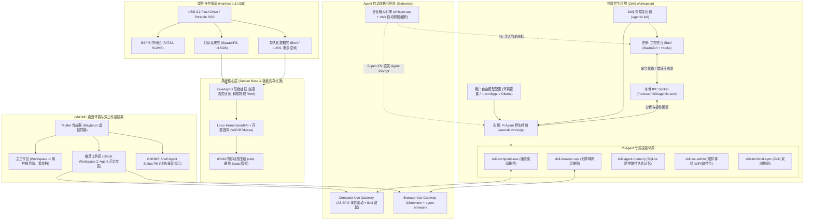

# AgenticOS 技术设计规范说明书 (Design Specification)

> **版本**：v1.3.0  
> **日期**：2026-09-19  
> **状态**：已批准 (Approved)  
> **定位**：基于 Debian 的随身便携式 AI 原生操作系统 (Portable Agentic Live OS)

---

## 1. 概述与核心愿景 (Overview & Vision)

**AgenticOS** 是一款专为 AI 时代极客与开发者打造的随身移动操作系统。它通过单个可启动 U 盘在任何 x86_64 电脑或笔记本上即插即用，无缝提供开箱即用的 AI 伴生生产力环境。

融合开源生态（AIOS, HARTOS, Open Interpreter, Tails, Slax）的最佳实践，AgenticOS 具备以下五大核心壁垒：
1. **真随身便携与最大化可用内存**：采用只读 SquashFS 与 OverlayFS 持久化。**默认采用闪存流式按需加载（Direct-Stream），冷机仅占用 ~750MB 内存**，将 85%~90% 的物理 RAM 完整留给用户运行本地大模型与开发任务；同时内置 **zRAM 内存动态压缩** 与 `commit=60` 闪存抗磨损优化；
2. **独创「幽灵桌面」(Ghost Workspace) 零干扰 Computer Use**：在独立虚拟工作区驱动 GUI 和浏览器，**彻底解决 Agent 抢夺用户鼠标焦点 (Focus Stealing)** 的业界通用痛点，实现真正的人机无缝并行工作；
3. **极速高效的 Browser Use 原生栈**：内置优化版 Chromium 与 `agent-browser` 自动化引擎，基于 DOM 无障碍树生成 `@eN` 紧凑引用快照，节省 90% 模型 Token，且支持 Cookie 与会话持久化；
4. **Pi Agent 专属技能体系与自由模型配置**：Pi Agent 原生内置 Computer Use、Browser Use、系统运维与终端同步等专属技能。**彻底摒弃繁琐的菜单向导，模型配置 100% 遵从标准 Unix 哲学**——用户直接通过环境变量、Pi 原生配置文件（`~/.config/pi/`）或 CLI 参数自由指定任意云端 API（Claude, GPT, DeepSeek, Gemini 等）或本地运行时（Ollama, llama.cpp 等），配置持久化保存；
5. **VAD 智能停顿断句与双模语音交互**：基于 `whisper.cpp` + `Blurt` GNOME 原生 UI，支持 **单按 `F5` 说话停顿自动上屏** 与 **`Super+F5` 全局口述直接派发任务给 Pi Agent**。

---

## 2. 系统整体架构图 (System Architecture)


```
```

---

## 3. 存储、持久化与闪存抗磨损黑科技 (Storage & Flash Optimization)

### 3.1 分区布局 (Disk Layout)
U 盘使用 GPT 分区表，支持现代 UEFI 快速安全启动与传统 Legacy BIOS：

| 分区序号 | 卷标 (Label) | 大小 | 文件系统 | 挂载点/用途 | 读写属性 |
| :--- | :--- | :--- | :--- | :--- | :--- |
| **p1** | `ESP` | 512 MB | FAT32 | `/boot/efi`，包含 GRUB2 EFI x86_64 引导加载项 | 只读 (运行时) |
| **p2** | `AGENTIC_LIVE` | 4 GB | ISO9660 / SquashFS | Live OS 只读根系统镜像 (Rootfs) | 严格只读 (RO) |
| **p3** | `persistence` | 剩余容量 (如 28GB+) | Ext4 (可选 LUKS 加密) | 持久化数据层，保存增量修改与用户配置 | 读写 (RW) |

### 3.2 内存极致让渡与闪存抗磨损优化策略
1. **默认采用闪存流式按需加载 (Default: Direct Flash Streaming & On-Demand Paging)**：
   - **设计理念：最大化保留物理 RAM 供给本地大模型与开发任务**；
   - 系统镜像启动后，仅由 Linux 内核按需从 USB 3.2 高速读取，**冷机基础占用仅 ~750MB 内存**！
   - 在 8GB 笔记本上可留出 **~7.2GB 纯净物理内存**；在 16GB 机器上可留出 **~15GB 内存**，从容承载 1.5B/3B/7B 本地模型的加载与多轮上下文推理，彻底避免 OOM 崩溃。
2. **`toram` 降为大内存专用高级选项 (Optional for 32GB+ RAM Only)**：
   - GRUB 菜单中保留但标注提示：`AgenticOS (RAM-Mode [Caution: Consumes 4GB RAM, only for 32GB+ systems])`；
   - 供 32GB/64GB 超大内存工作站用户或打算在运行后拔掉 U 盘的特殊场景使用。
3. **zRAM 压缩内存动态保护（彻底替代磁盘 Swap）**：
   - 预装 `zram-tools`，设置压缩算法为 `zstd`；
   - 当用户在本地加载较大参数模型（如 7B/8B）导致物理内存逼近极限时，zRAM 在内存中提供弹性的无损动态压缩缓冲，**使 8GB 内存等效拓展至 12~14GB**，既防止物理闪存被 Swap 磨损烧毁，又可有效免疫 OOM-Killer 强杀模型进程。
4. **OverlayFS 持久化防抖挂载**：
   - `persistence` 分区挂载参数强制开启：`noatime,nodiratime,commit=60,data=ordered`；
   - 将系统元数据写入与数据提交延时合并至 60 秒一批次，小文件写放大降低 80%；
   - `/tmp`、`/var/log`、`/var/tmp` 默认挂载为独立 `tmpfs` 内存盘，关机自动清空，零闪存写入。

---

## 4. 桌面环境与「幽灵桌面」(Ghost Workspace) 零干扰架构

### 4.1 核心痛点与「幽灵桌面」机制 (Ghost Workspace)
针对业界目前 Computer Use 最大的痛点——**“Agent 操控鼠标时与人类抢夺焦点导致人类无法工作”**，AgenticOS 实现了一套物理隔离机制：
- **双工作区自动绑定**：
  - **Workspace 1（人类专注区）**：用户的主工作界面（终端、代码编辑器、主浏览器）；
  - **Workspace 2（Ghost Workspace 幽灵工作区）**：由后台服务为 Agent 独立分配的操作桌面。
- **并行零干扰操控**：
  - Agent 收到 Computer Use 任务时，自动在 Workspace 2 拉起目标窗口并将其绑定到虚拟输入流；
  - Agent 在 Workspace 2 中进行移动、点击、输入与截屏；
  - 用户的鼠标与键盘输入始终锁定在 Workspace 1，人类可以边敲代码，边通过 GNOME 顶栏的画中画（PiP）或随时按 `Super+2` 观察 Agent 的执行进展。

### 4.2 AT-SPI2 事件驱动（告别死等截屏）
- Agentic Gateway 订阅 D-Bus `org.a11y.Bus` 上的状态变化事件（`object:state-changed`、`window:activate`、`load:complete`）；
- 每次 Agent 触发点击操作后，系统在捕获到页面状态变更信号时毫秒级唤醒 Agent，响应效率相比传统轮询截屏提升 10 倍，极大降低 Token 与延迟。

---

## 5. 面向 Agent 的 Browser Use 深度优化技术栈 (Browser Use Stack)

### 5.1 浏览器引擎与 CDP 桥接 (Chromium + CDP)
- **底层选型**：内置轻量预调优的 **Chromium**，预装 WebGL/WebGPU 开源驱动库（`libvulkan1`, `mesa-vulkan-drivers`）。
- **常驻/按需自动化通道**：
  - 支持通过 Chrome DevTools Protocol (CDP) 暴露 `--remote-debugging-port=9222`；
  - 默认运行在后台或幽灵工作区，与用户日常前台使用的浏览器配置文件相互隔离，互不串话。

### 5.2 `agent-browser` 极速无障碍快照引擎
集成并预置高性能自动化 CLI 引擎 `agent-browser`：
1. **语义无障碍树快照 (`snapshot -i`)**：
   - 提取视口内可交互元素生成紧凑的 Accessibility Tree 快照与 `@eN` 引用标签；单页消费仅需 **200 ~ 400 Tokens**（相比传统 HTML 解析节省 90% 以上上下文空间）。
2. **带标截图 (`screenshot --annotate`)**：自动在元素上打出编号标签，供视觉多模态大模型双重校验。
3. **Markdown 智能阅读器 (`read [url]`)**：发送 `Accept: text/markdown`，优先拉取纯文本并自动寻找 `llms.txt`。

### 5.3 登录态与会话持久化 (Session & Auth Vault)
- 用户的 Cookie、Local Storage 和 IndexedDB 存储重定向至 U 盘的 `persistence` 分区。用户在初次登录一次 GitHub 或文档站后，拔插换电脑无需重新鉴权。

---

## 6. Pi Agent 专属技能与自由模型配置 (Pi Skills & Direct Model Configuration)

Pi Agent（`@earendil-works/pi-coding-agent`）预置 5 大专属 Extension/Skills（存放于 `/etc/pi/skills/` 并软链到用户环境）：

```
~/.config/pi/skills/
├── skill-computer-use/      # 幽灵工作区 GUI 语义树与键鼠操控技能
├── skill-browser-use/       # 网页极速无障碍快照与导航技能
├── skill-agent-memory/      # SQLite 跨会话随身长效记忆库
├── skill-os-admin/          # 随身系统体检、WiFi、软件包管理技能
└── skill-terminal-sync/     # Zellij 左侧 Shell 实时上下文同步技能
```

### 6.1 用户原生自主模型配置 (Direct Model Configuration)
系统坚守 Unix 哲学，**拒绝死板交互菜单与臃肿向导，完全由用户按自己的喜好自主配置模型**：
- **配置文件原生持久化**：
  用户直接在 `~/.config/pi/config.json` 或 `~/.bashrc` 中写入自己的模型配置，配置文件安全持久化在 U 盘的 `persistence` 分区中，拔插换电脑无需重新设置。
- **全生态模型自由接入**：
  1. **云端主流商用模型**：通过标准环境变量（如 `ANTHROPIC_API_KEY`, `OPENAI_API_KEY`, `GEMINI_API_KEY`, `DEEPSEEK_API_KEY`）或命令行参数 `pi --model <provider/model>` 直接使用；
  2. **本地开源模型 (Ollama / 本地 GGUF)**：
     - 系统预置 `ollama` CLI 基础环境。如果用户希望离线本地跑模型，可自主执行 `ollama run <model>` 或自启 `llama-server`；
     - 在 Pi 中直接配置 `OLLAMA_HOST` 或 `pi --provider ollama --model <model_name>` 即可无缝调用；
  3. **局域网/私有服务器算力**：直接在配置中指定内网服务地址，随身系统即刻化身为远程大算力客户端。

### 6.2 专属技能列表
1. **`skill-computer-use`**：对接幽灵工作区，调度 `desktop_inspect_tree`、`desktop_click_element`、`desktop_type_text`、`desktop_screenshot`；
2. **`skill-browser-use`**：桥接 `agent-browser`，提供 `browser_open`、`browser_snapshot`、`browser_click`、`browser_fill` 与 `browser_read_markdown`；
3. **`skill-agent-memory`（跨电脑长效外脑）**：基于 SQLite-VSS 本地向量轻量库，自动索引用户的项目偏好、个人指令别名、曾解决过的历史 Bug 经验，拔下 U 盘换电脑依旧记得你；
4. **`skill-os-admin`**：执行 `sys_doctor`（U盘磨损、电池、显卡）、`sys_wifi_connect`（调用 NetworkManager 智能连网）、`sys_package_install`；
5. **`skill-terminal-sync`**：执行 `terminal_read_pane`（抓取左侧 Shell 视口）、`terminal_send_command`（向左侧注入推荐指令）。

---

## 7. 全局本地语音输入法与 GNOME 原生 UI (Voice-to-Text & VAD)

基于社区成熟的 **`Blurt` GNOME Shell 原生扩展** 与 `whisper.cpp` 本地离线引擎，提供极致丝滑的语音体验。

### 7.1 核心技术与 VAD 自动断句
- **本地离线模型**：内置 `whisper.cpp` + `ggml-base.bin`（~140MB，中英双语优化），CPU 识别延迟 **< 280ms**，零流量消耗、零隐私外泄；
- **VAD (Voice Activity Detection) 智能停顿断句**：
  - 用户按下 `F5` 启动录音；
  - 说话完毕停顿静音 1.0 秒后，VAD 自动切断音频并触发推理，**用户无需再按一次键**即可自动上屏！
- **原生 GNOME Shell UI**：GNOME 顶栏原生 St 控件，录音时展现脉冲红点与音量波形动画，推理时旋转 Spinner，完成后平滑隐藏。

### 7.2 双模快捷键交互
| 快捷键 | 交互动作 | 作用说明 |
| :--- | :--- | :--- |
| **`F5`** | **光标直输模式** | 自动转录并将文字毫秒级键入当前活动的文本输入框（终端 Shell、浏览器、编辑器） |
| **`Super + F5`** | **Agent 口述直达模式** | 全局截获语音，转录后直接作为 Prompt 投递至右侧 Pi Agent 终端，无需切换窗口焦点 |

---

## 8. 终端深度伴生与双向 IPC (Terminal Companion & IPC)

### 8.1 Zellij 伴生布局 (`agentic.kdl`)
- **分屏比例**：主 Shell (65%) : Pi Agent (35%)；
- **左侧 (Main Shell)**：Bash / Zsh 原生终端；
- **右侧 (Pi Agent)**：常驻运行 `pi` 交互式会话，内置专属 6 大技能包。

### 8.2 上下文流转与 Shell Hooks
在用户环境中注入 `~/.config/agentic/shell-hooks.sh`：
1. **执行状态监测 (`postexec`)**：
   - 捕获命令异常退出码，自动向 Socket `/run/user/UID/agentic.sock` 投递错误诊断事件；右侧 Pi Agent 自动呈现红色状态徽标并展示修复方案。
2. **快捷键一键投递**：
   - `Alt + A`：当前命令投递给 Pi；
   - `Alt + B`：抓取左侧终端最后 50 行日志投递给 Pi 分析；
   - `Alt + C`：唤醒 Agent Computer Use 在幽灵工作区执行任务。

---

## 9. 桌面美学、专注细节与系统级运维 (Material Design & Focus UX)

### 9.1 Material Design 3 (Material You) 桌面设计规范
系统摒弃沉闷的传统默认桌面，全方位引入现代 **Material Design 3 (Material You)** 设计语言：
- **卡片式分层与几何形态 (Elevation & Shapes)**：
  - 窗口与弹出面板统一采用大圆角设计（容器 `16px`，弹窗与搜索框 `24px`，按钮 `12px`）；
  - 去除生硬的高反差边框，通过柔和的阴影扩散（Ambient Shadow）与色彩明暗区隔层次；
- **调色板规范 (Material Color Palette)**：
  - 采用深色调的 **Material Slate & Deep Charcoal** 作为基底，搭配低饱和度的柔和青蓝（Teal）或淡紫（Lavender）强调色，长时间盯屏舒适不刺眼；
  - 界面图标采用 **Papirus-Material** 高清矢量图标库，兼具极简扁平与高辨识度。

### 9.2 全套内置 Nerd Fonts 体系 (Built-in Nerd Fonts)
系统在 `/usr/share/fonts/truetype/nerd-fonts/` 默认安装并配置主流现代开发者字体，开机即用：
- **编程等宽主力字体**：
  - **FiraCode Nerd Font**（默认首选，开启编程连字 `Programming Ligatures`，如 `!=`, `===`, `=>` 等）；
  - **JetBrainsMono Nerd Font**（备选，结构开阔、大字重清晰）；
- **全量图标字形覆盖 (Glyphs & Icons)**：
  - 完整内嵌 Powerline 箭头、Devicons 开发者图标（Git 分支、Docker、Rust、Python、Node、K8s 等），保证 Zsh / Starship 提示符与 Zellij 标签栏图标 100% 完美渲染，绝无方块乱码；
- **UI 与阅读字体**：**Roboto / Inter** 搭配 **Noto Sans CJK SC**（思源黑体），中英文混排锐利规整。

### 9.3 专注度与使用体验打磨细节 (Focus & Polish Details)
为了让开发者插上 U 盘即可进入“心流”状态，系统特别植入了四项专注度与交互细节：
1. **非活动窗口自适应微调压暗 (Inactive Window Dimming - 视线聚焦)**：
   - 桌面多窗口并存时，未获得焦点的窗口自动平滑变暗 15%~20%，主编辑/主终端窗口保持明亮高光。视线自然锚定在核心任务上，大幅降低多屏多窗口的分心感；
2. **Material 3 灵动药丸 (Dynamic Agent Chip)**：
   - 顶栏中央内嵌 Material 3 全圆角 Chip 胶囊指示器，带微妙的呼吸微动效，实时直观显示 Agent 状态：
     - `⚪ Idle`：Agent 就绪监听
     - `🟢 Thinking`：正在流式推理或排查错误
     - `🟣 Browser`：正在无障碍操控浏览器
     - `🔵 Ghost WS`：正在后台幽灵桌面接管 GUI
     - `🔴 Voice 🎙️`：正在接收 F5 本地语音输入
3. **极客一键沉浸“禅模式” (Zen Focus Mode: `Super + F11`)**：
   - 按下快捷键瞬间隐藏 GNOME 顶栏托盘与非必要桌面小组件，静音所有非致命桌面通知（Do Not Disturb），全屏独占呈现 65:35 的主 Shell 与 Pi 伴生工作区；
4. **Material 动效曲线与低扰动声效反馈**：
   - 窗口切换采用 200ms 的 Standard Decelerate 动画曲线，丝滑灵动且响应干脆；
   - 本地语音识别完成、Pi Agent 长任务执行完毕或后台耗时编译完成时，发出极其微弱柔和的水滴提示音（Libcanberra），无需频繁切屏即可知晓进度。

### 9.4 Pi Agent 系统级工具集 (CLI Commands)
- `pi doctor`：检测当前电脑 CPU/内存/电池、GPU 硬件加速（Vulkan/VA-API）及 WiFi 驱动状态；
- `pi net`：智能探测 WiFi 接入点、网络认证门禁 (Captive Portal)、DNS 状态与代理设置并自动辅助连接；
- `pi pkg`：智能语义搜索 Debian 软件源并指导持久化安装。

---

## 10. 安全与凭据隔离 (Security & Privacy)

1. **持久化分区加密**：支持 LUKS 加密，开机在 GRUB 提示输入密码解密，丢失 U 盘不会泄露任何代码与会话；
2. **凭据安全**：预置 `libsecret`，API Key 与 Token 存入持久化区；
3. **动态 Host Key**：首次启动生成随机 SSH Host Key；
4. **语音与离线模型数据安全**：语音与离线模型推理均在本地内存执行，物理安全隔离。

---

## 11. 构建工程与交付产物 (Build & Packaging Pipeline)

### 11.1 源码仓库目录结构
```text
agentic-os/
├── Makefile                          # 构建驱动脚本
├── auto/
│   ├── config                        # live-build 自动化参数 (debian bookworm/trixie)
│   └── build
├── config/
│   ├── package-lists/
│   │   ├── 00-base.list.chroot       # 核心内核与基础环境 (zram-tools, btrfs-progs)
│   │   ├── 01-firmware.list.chroot   # 通用硬件网卡与显卡固件
│   │   ├── 02-desktop.list.chroot    # 裁剪版 GNOME、Mutter、Material-3 主题、Papirus 图标、AT-SPI2
│   │   ├── 03-terminal.list.chroot   # Zellij, Ptyxis/Alacritty, Zsh, FiraCode/JetBrainsMono Nerd-Fonts
│   │   ├── 04-browser.list.chroot    # Chromium, agent-browser, mesa-vulkan-drivers
│   │   ├── 05-voice.list.chroot      # whisper.cpp, pipewire, libcanberra, wtype
│   │   └── 06-agentic.list.chroot    # Python pyatspi, libei, pi (@earendil-works/pi-coding-agent), ollama
│   ├── includes.chroot/              # 目标系统文件覆盖层
│   │   ├── etc/
│   │   │   ├── dconf/db/local.d/     # 激活无障碍、Blurt (F5/Super+F5)、Material-3 主题与禅模式快捷键
│   │   │   ├── default/zramswap      # zram 预设算法 zstd
│   │   │   ├── zellij/agentic.kdl    # 终端默认伴生布局 (65:35)
│   │   │   ├── pi/skills/            # 预装 Pi 专属五大 Skills
│   │   │   └── systemd/system/       # computer-use-gateway.service
│   │   ├── usr/share/agentic/models/ # 预置 whisper.cpp base 离线语音模型 (~140MB)
│   │   └── usr/local/bin/
│   │       ├── computer-use-gateway  # 幽灵工作区无障碍与输入代理网关
│   │       ├── pi-doctor             # 硬件诊断工具
│   │       └── agentic-shell-hook    # 终端 Hook
│   └── hooks/live/
│       ├── 01-setup-agentic-env.hook.chroot # 用户权限、zram 与抗磨损挂载配置
│       ├── 02-install-pi-agent.hook.chroot  # 安装并配置 pi CLI 与专属 5 大 skills
│       └── 03-setup-blurt-voice.hook.chroot # 安装配置 Blurt GNOME 扩展、whisper.cpp 与 F5/Super+F5
└── scripts/
    ├── test-qemu.sh                  # 本地 QEMU 虚拟机快速验证
    └── flash-usb.sh                  # U 盘自动分区、烧录与持久化分区初始化 (含 commit=60 调优)
```

### 11.2 自动化交付与验证流程
1. **构建 ISO**：
   ```bash
   make build
   ```
2. **QEMU 本地无损测试**：
   ```bash
   make test-qemu
   ```
3. **物理 U 盘烧录**：
   ```bash
   sudo ./scripts/flash-usb.sh /dev/sdX
   ```

---

## 12. 验收标准与验证矩阵 (Acceptance Criteria)

| 验证项 | 验证方法与指标 | 预期通过标准 |
| :--- | :--- | :--- |
| **UEFI/BIOS 引导** | 在 Intel / AMD 实体机或 QEMU 双模式引导 | 成功进入 GRUB 菜单，进入桌面时间 < 25 秒 |
| **极致内存释放** | 默认模式启动，运行 `free -m` 检查 | 系统底座占用仅 ≤ 750 MB，物理 RAM 剩余 85%+ 完整留给本地 LLM 与开发 |
| **zRAM 内存防击穿** | 运行 `zramctl` | 呈现使用 `zstd` 算法的压缩块设备，无物理 Swap 分区写磨损 |
| **幽灵桌面零干扰** | 触发 Computer Use 操控任务并在前台打字 | 任务在 Workspace 2 执行，Workspace 1 的人类鼠标光标与窗口焦点零被抢夺 |
| **AT-SPI2 语义读取** | 执行 `computer-use-gateway --dump-tree` | 完整输出当前激活窗口的控件树与坐标 JSON |
| **Browser Use 自动化** | 执行 `agent-browser open https://example.com && agent-browser snapshot -i` | 正确返回 `@eN` 格式可交互无障碍快照，延迟 < 1s |
| **自由模型配置与持久化** | 在 `~/.config/pi/` 或环境变量中配置 API Key 或本地 Ollama | Pi Agent 准确识别并调用对应模型，重启系统后配置与 Token 完整保留 |
| **F5 语音与 VAD 断句** | 按 `F5` 说话，停止发音 1.0 秒 | 自动截断、转录并键入到活动光标，全流程无需按第二次按键 |
| **Super+F5 语音直达** | 在任意桌面窗口按 `Super+F5` 口述需求 | 语音自动转录并作为 Prompt 投递至右侧 Pi Agent 启动执行 |
| **防拔出抗损** | 读写操作中拔出 U 盘，重新插入后启动 | 系统只读层无损，数据增量保留，系统可再次正常启动 |
